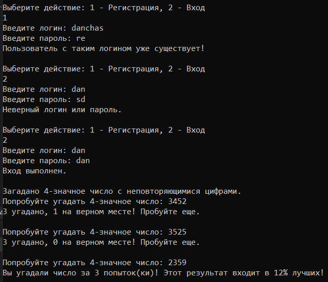

Игра «Угадай Число»

Простая консольная игра, в которой игроку предлагается угадать четырёхзначное число с уникальными цифрами. Игра включает авторизацию пользователя с логином и паролем, а также сохраняет и отображает счёт участников в таблице лидеров.

Игра, в которой каждый ход игрок пытается угадать четырёхзначное число, сгенерированное компьютером. Число состоит из уникальных цифр, и игрокам нужно использовать подсказки, чтобы его определить. Проект включает:

- Авторизацию для отслеживания прогресса каждого игрока.
- Таблицу лидеров, показывающую, в какой процент лучших результатов входит текущий результат игрока.

- **Язык программирования**: C#
- **Формат хранения данных**: JSON (используется для хранения данных игроков и их счёта)

Генерация числа происходит следующим образом:
Берется массив цифр от 0 до 9, рандомно перемешивается, проверяется, чтобы первая цифра была не 0 (если 0, то меняется со второй цифрой), затем берутся первые 4 цифры, которые и окажутся нужным числом.

            //массив цифр от 0 до 9
            int[] digits = Enumerable.Range(0, 10).ToArray();
            
            //рандомно перемешиваю массив
            digits = digits.OrderBy(x => random.Next()).ToArray();

            //Проверяю, чтобы первая цифра не была 0
            if (digits[0] == 0)
            {
                //Меняю местами ноль с первой ненулевой цифрой
                for (int i = 1; i < digits.Length; i++)
                {
                    if (digits[i] != 0)
                    {
                        int temp = digits[0];
                        digits[0] = digits[i];
                        digits[i] = temp;
                        break;
                    }
                }
            }
            //первые 4 цифры - загаданное число
            string number = string.Join("", digits.Take(4));
            Console.WriteLine("\nЗагадано 4-значное число с неповторяющимися цифрами."); 
            
Вот, как выглядит игра:

